# Inventory Management System - Architecture Documentation

**Date:** 21 March 2026  
**Version:** 1.0  
**Status:** Complete Implementation

---

## Table of Contents

1. [Overview](#overview)
2. [System Architecture](#system-architecture)
3. [Database Schema](#database-schema)
4. [Table Relationships](#table-relationships)
5. [Data Flow Diagrams](#data-flow-diagrams)
6. [Stock Movement Tracking](#stock-movement-tracking)
7. [Integration Points](#integration-points)
8. [API Endpoints](#api-endpoints)

---

## Overview

The Hospital Management System uses a **centralized Products catalog** with distributed stock tracking across multiple tables. This architecture ensures:

- **Single Source of Truth**: Products table is the master catalog
- **Audit Trail**: Every stock change is recorded in stock_movements
- **Batch Tracking**: Medicine batches tracked separately for expiry management
- **Real-time Summary**: Stock summary provides instant overview
- **Alert System**: Automated alerts for low stock and expiring items

---

## System Architecture

### High-Level Architecture

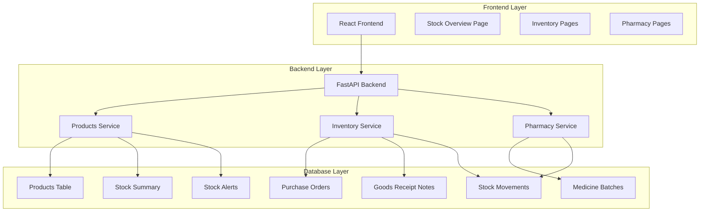

---

## Database Schema

### Core Tables Overview

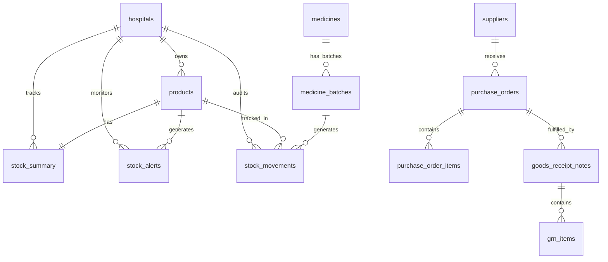

---

## Table Relationships

### Complete Entity Relationship Diagram

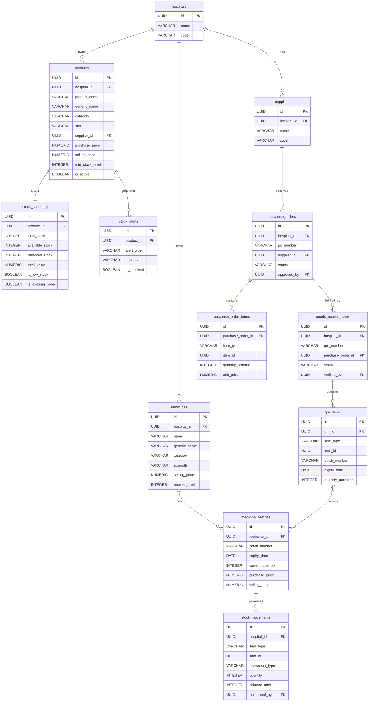

---

## Data Flow Diagrams

### Flow 1: Procurement to Stock (Purchase Order → GRN → Stock In)

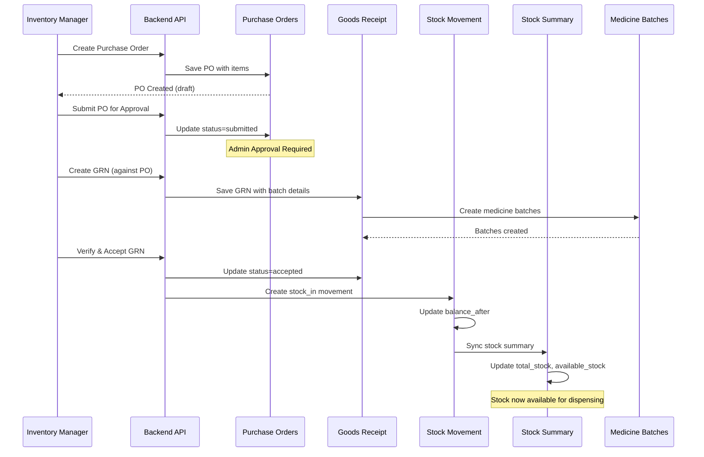

### Flow 2: Pharmacy Dispensing (Stock Out)

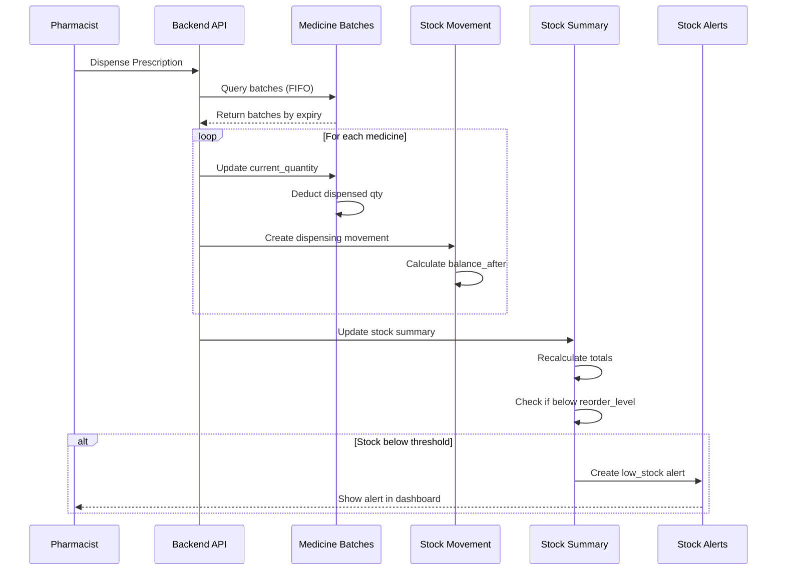

### Flow 3: Stock Adjustment (Manual Correction)

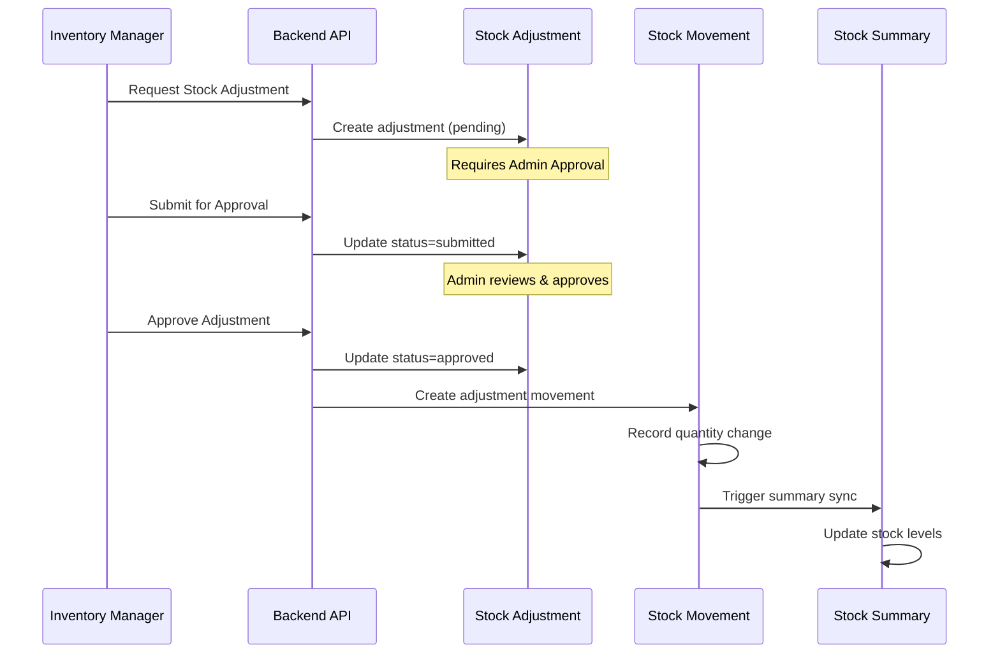

### Flow 4: Cycle Count Process

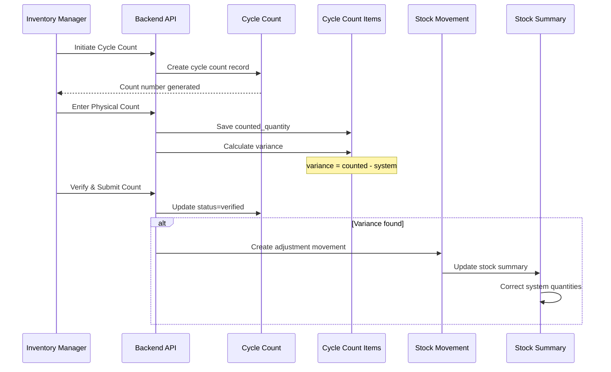

---

## Stock Movement Tracking

### Movement Types and Their Impact

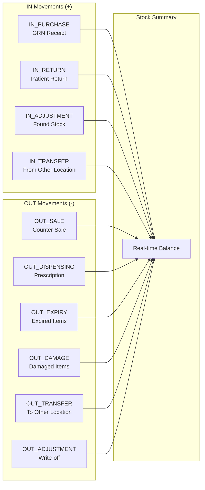

### Movement Type Reference Table

| Movement Type | Code | Direction | Trigger | Example |
|--------------|------|-----------|---------|---------|
| **Purchase Receipt** | `stock_in` | + | GRN Accepted | Received 100 units from supplier |
| **Sale** | `sale` | - | Counter Sale | OTC sale to patient |
| **Dispensing** | `dispensing` | - | Prescription Fill | Dispensed against Rx |
| **Return** | `return` | + | Patient Return | Unused medicine returned |
| **Adjustment In** | `adjustment` | + | Stock Found | Found during audit |
| **Adjustment Out** | `adjustment` | - | Stock Write-off | Damaged/lost items |
| **Expiry** | `expired` | - | Expired Batch | Past expiry date |
| **Damage** | `damaged` | - | Quality Check | Found damaged |
| **Transfer Out** | `transfer` | - | Inter-branch Transfer | Sent to branch hospital |
| **Transfer In** | `transfer` | + | Inter-branch Transfer | Received from main hospital |

---

## Integration Points

### How Tables Link Together

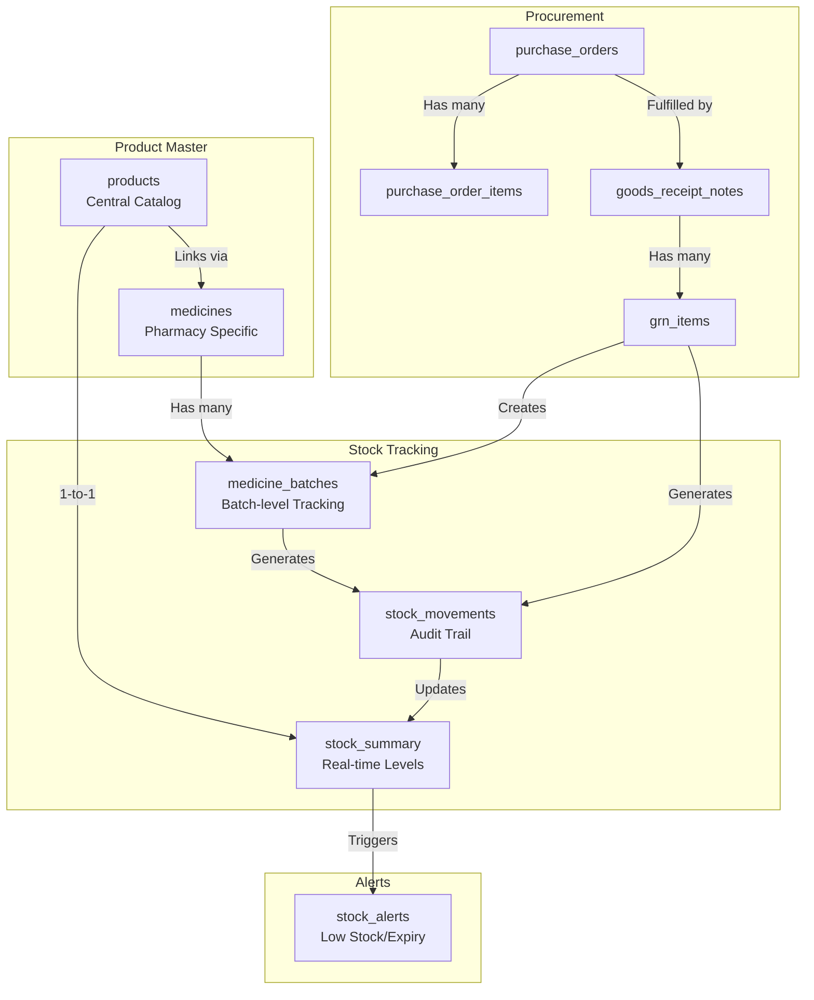

### Product-to-Medicine Linking Strategy

The system uses **two complementary tables** for medicine tracking:

```mermaid
graph LR
    subgraph "Products Table (Inventory)"
        P[products<br/>- All hospital products<br/>- Medicines, Optical, Surgical<br/>- Equipment, Laboratory<br/>- Central catalog for stock]
    end
    
    subgraph "Medicines Table (Pharmacy)"
        M[medicines<br/>- Prescription-specific data<br/>- Dosage forms<br/>- Pharmacy formulary<br/>- Clinical information]
    end
    
    subgraph "Linking Strategy"
        L[Link via:<br/>1. generic_name<br/>2. hospital_id<br/>3. Manual product_id FK<br/>   (if medicine created from product)]
    end
    
    P --> L
    M --> L
```

**Best Practice**: When creating a medicine, also create a corresponding product record for unified stock tracking.

---

## API Endpoints

### Products & Stock Management

```mermaid
graph TB
    subgraph "Product CRUD"
        GET1[GET /products<br/>List products]
        GET2[GET /products/{id}<br/>Get product details]
        POST1[POST /products<br/>Create product]
        PUT1[PUT /products/{id}<br/>Update product]
        DEL1[DELETE /products/{id}<br/>Delete product]
    end
    
    subgraph "Stock Overview"
        DASH[GET /stock/dashboard<br/>Dashboard stats]
        OVER[GET /stock/overview<br/>Stock overview]
        LOW[GET /stock/low-stock<br/>Low stock items]
        EXP[GET /stock/expiring<br/>Expiring items]
        SYNC[POST /stock/sync<br/>Sync summary]
    end
    
    subgraph "Alerts"
        ALERT_GET[GET /alerts<br/>List alerts]
        ALERT_POST[POST /alerts<br/>Create alert]
        ALERT_RES[PUT /alerts/{id}/resolve<br/>Resolve alert]
        ALERT_ACK[PUT /alerts/{id}/acknowledge<br/>Acknowledge alert]
    end
```

### Complete Endpoint Reference

| Method | Endpoint | Description | Role Required |
|--------|----------|-------------|---------------|
| **Products** |
| GET | `/api/v1/inventory/products` | List all products | inventory_manager, admin |
| GET | `/api/v1/inventory/products/{id}` | Get product with stock | inventory_manager, admin, pharmacist |
| POST | `/api/v1/inventory/products` | Create new product | inventory_manager, admin |
| PUT | `/api/v1/inventory/products/{id}` | Update product | inventory_manager, admin |
| DELETE | `/api/v1/inventory/products/{id}` | Soft delete product | admin |
| **Stock** |
| GET | `/api/v1/inventory/stock/dashboard` | Dashboard statistics | inventory_manager, admin, pharmacist |
| GET | `/api/v1/inventory/stock/overview` | Stock overview with filters | inventory_manager, admin, pharmacist |
| GET | `/api/v1/inventory/stock/low-stock` | Low stock items | inventory_manager, admin, pharmacist |
| GET | `/api/v1/inventory/stock/expiring` | Expiring items | inventory_manager, admin, pharmacist |
| POST | `/api/v1/inventory/stock/sync` | Sync stock summary | inventory_manager, admin |
| **Alerts** |
| GET | `/api/v1/inventory/alerts` | List stock alerts | inventory_manager, admin, pharmacist |
| POST | `/api/v1/inventory/alerts` | Create manual alert | inventory_manager, admin |
| PUT | `/api/v1/inventory/alerts/{id}/resolve` | Resolve alert | inventory_manager, admin |
| PUT | `/api/v1/inventory/alerts/{id}/acknowledge` | Acknowledge alert | inventory_manager, admin, pharmacist |

---

## Stock Consistency & Data Integrity

### How Stock is Kept Consistent

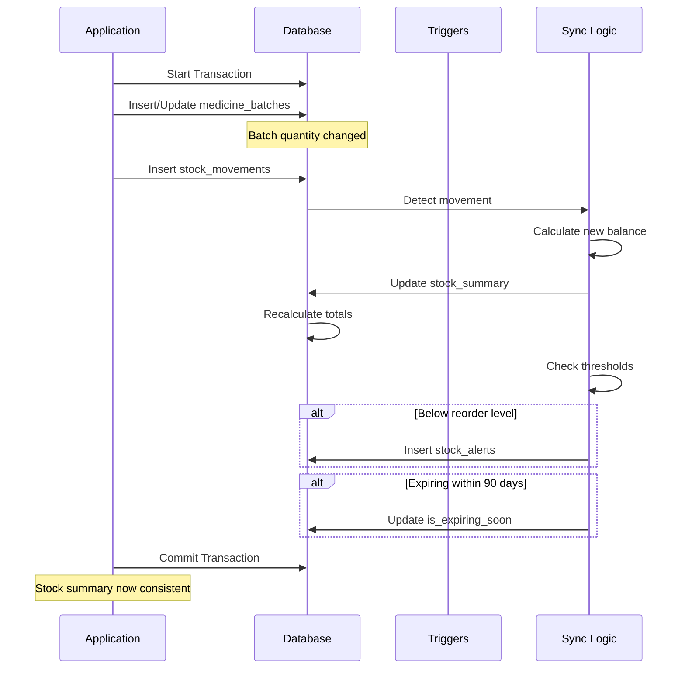

### Consistency Rules

1. **Every batch change creates a movement**
   - No direct batch updates without audit trail
   
2. **Stock summary is auto-synced**
   - Triggered after every movement
   - Uses weighted average for cost calculation
   
3. **Alerts are auto-generated**
   - Low stock: When `available_stock <= reorder_level`
   - Expiring soon: When `earliest_expiry <= 90 days`
   
4. **No negative stock allowed**
   - Validated before dispensing/sale
   - Returns error if insufficient stock

---

## Views for Reporting

### Pre-built Database Views

#### 1. `v_product_medicine_link`
Links products with medicines for unified reporting.

```sql
SELECT 
    p.product_name,
    m.strength,
    m.unit_of_measure,
    ss.available_stock,
    ss.total_value
FROM products p
JOIN medicines m ON p.generic_name = m.generic_name
JOIN stock_summary ss ON p.id = ss.product_id;
```

#### 2. `v_product_stock_movements`
Aggregates stock movements by product and type.

```sql
SELECT 
    product_name,
    movement_type,
    SUM(quantity) as total_qty,
    SUM(quantity * unit_cost) as total_value
FROM v_product_stock_movements
GROUP BY product_name, movement_type;
```

#### 3. `v_inventory_dashboard`
Provides real-time inventory KPIs.

```sql
SELECT 
    total_products,
    total_medicines,
    total_inventory_value,
    low_stock_products,
    expiring_soon_products,
    active_alerts
FROM v_inventory_dashboard;
```

---

## File Structure

```
backend/
├── app/
│   ├── models/
│   │   ├── products.py          # Product, StockSummary, StockAlert
│   │   ├── inventory.py         # PO, GRN, StockMovement, Adjustment
│   │   └── pharmacy.py          # MedicineBatch, PharmacySale
│   ├── schemas/
│   │   └── products.py          # Pydantic schemas
│   ├── services/
│   │   ├── products_service.py  # Product & stock business logic
│   │   └── inventory_service.py # Procurement & movement logic
│   └── routers/
│       └── products.py          # API endpoints
│
database_hole/
├── 01_schema.sql                # Base schema
├── 02_seed_data.sql             # Initial seed data
├── 04_inventory_seed.sql        # Inventory sample data
├── 06_products_master_table.sql # Products table creation
└── 07_seed_products.sql         # Products seed data (this file)
```

---

## Quick Reference: Stock Tracking Flow

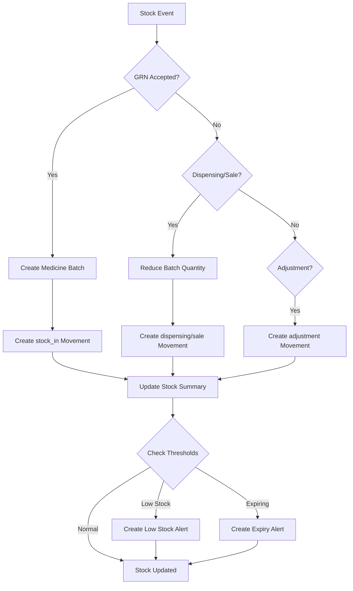

---

## Summary

The HMS Inventory system provides:

✅ **Centralized Product Catalog** - Single source of truth for all items  
✅ **Real-time Stock Tracking** - Updated on every transaction  
✅ **Complete Audit Trail** - Every movement recorded  
✅ **Batch-level Expiry Tracking** - FIFO dispensing  
✅ **Automated Alerts** - Low stock and expiry notifications  
✅ **Multi-category Support** - Medicines, Optical, Surgical, Equipment, Laboratory  
✅ **Segregation of Duties** - GRN creator cannot verify  
✅ **Integration Ready** - Links with Pharmacy, Procurement, Sales  

---

**Documentation Version:** 1.0  
**Last Updated:** 21 March 2026  
**Maintained By:** Development Team
