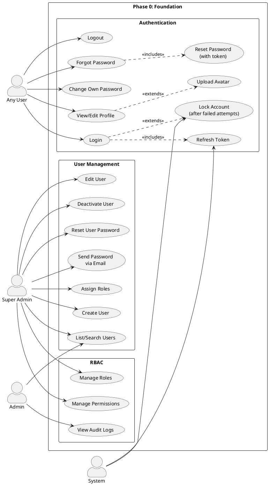

# Phase 0 — Foundation: Use Cases

> Authentication, User Management, Role-Based Access Control

---

## Actors

| Actor | Description |
|-------|-------------|
| **Any User** | Any person with an HMS account |
| **Super Admin** | Full system access, manages users and roles |
| **Admin** | Hospital administration, views audit logs |
| **System** | Automated processes (token refresh, lockout) |

---

## Use Case Diagram



---

## Use Case Descriptions

### UC01: Login

| Field | Value |
|-------|-------|
| **Actor** | Any User |
| **Precondition** | User has a valid account |
| **Main Flow** | 1. User enters username/email + password → 2. System validates credentials → 3. System issues access token + refresh token → 4. User is redirected to dashboard |
| **Alternate** | If MFA enabled: System asks for TOTP code → User enters code → System verifies → Issues tokens |
| **Exception** | Wrong credentials → increment fail count. After 5 fails → lock account 15 minutes |

### UC02: Logout

| Field | Value |
|-------|-------|
| **Actor** | Any User |
| **Main Flow** | 1. User clicks logout → 2. System revokes refresh token → 3. User redirected to login page |

### UC04: Forgot Password

| Field | Value |
|-------|-------|
| **Actor** | Any User |
| **Main Flow** | 1. User clicks "Forgot Password" → 2. Enters email → 3. System sends reset link via email → 4. User clicks link → 5. Enters new password → 6. System updates password |
| **Exception** | Email not found → System still shows "link sent" (prevents enumeration) |

### UC06: Change Own Password

| Field | Value |
|-------|-------|
| **Actor** | Any User |
| **Precondition** | User is logged in |
| **Main Flow** | 1. User enters current password + new password → 2. System validates (current correct, new meets policy, not in last 5) → 3. Password updated |

### UC07: View/Edit Profile

| Field | Value |
|-------|-------|
| **Actor** | Any User |
| **Main Flow** | 1. User opens Profile page → 2. Views own info (name, email, role, phone) → 3. Can edit name, phone, language, timezone → 4. Can upload avatar photo |

### UC10: Create User

| Field | Value |
|-------|-------|
| **Actor** | Super Admin |
| **Main Flow** | 1. Super Admin fills form: name, email, username, password, role → 2. System validates uniqueness → 3. Creates account with `must_change_password = true` → 4. Auto-generates 12-digit reference number → 5. Optionally sends password via email |

### UC14: Reset User Password

| Field | Value |
|-------|-------|
| **Actor** | Super Admin |
| **Main Flow** | 1. Super Admin selects user → 2. Enters new password → 3. System updates password, sets `must_change_password = true` → 4. Optionally sends to user via email |

### UC15: Send Password via Email

| Field | Value |
|-------|-------|
| **Actor** | Super Admin |
| **Main Flow** | 1. Super Admin selects user → 2. Enters password + optional message → 3. System sends email to user → 4. Logs action in audit trail |

### UC17: Manage Roles

| Field | Value |
|-------|-------|
| **Actor** | Super Admin |
| **Main Flow** | 1. Super Admin views roles list → 2. Can create custom role → 3. Assigns permissions to role → 4. System roles (super_admin, admin) cannot be deleted |

### UC19: View Audit Logs

| Field | Value |
|-------|-------|
| **Actor** | Admin |
| **Main Flow** | 1. Admin opens audit log page → 2. Filters by user, action type, date range → 3. Views list of all create/update/delete operations with timestamps and actor |

---

## Flow: Login → Dashboard

```
User                        System                      Database
  │                            │                            │
  │── Enter credentials ──────▶│                            │
  │                            │── Validate password ──────▶│
  │                            │◀── User record ────────────│
  │                            │                            │
  │                            │── Check account locked? ──▶│
  │                            │◀── No ────────────────────│
  │                            │                            │
  │                            │── Check MFA enabled? ──────│
  │                            │   (if yes, ask for code)   │
  │                            │                            │
  │                            │── Generate JWT tokens ─────│
  │◀── Access + Refresh token ─│                            │
  │                            │                            │
  │── Request dashboard ──────▶│                            │
  │                            │── Verify JWT ──────────────│
  │                            │── Check permissions ──────▶│
  │◀── Dashboard data ────────│◀── User + roles ───────────│
  │                            │                            │
```

---

## Flow: Super Admin Creates User

```
Super Admin                 System                      Email Service
  │                            │                            │
  │── Fill user form ─────────▶│                            │
  │   (name, email, role,      │                            │
  │    password)               │                            │
  │                            │── Validate unique email ───│
  │                            │── Hash password ───────────│
  │                            │── Generate ref number ─────│
  │                            │── Save to DB ──────────────│
  │                            │                            │
  │                            │── Send password email? ───▶│
  │                            │                            │── Email to user
  │◀── User created ──────────│                            │
  │   (with ref number)        │                            │
```
