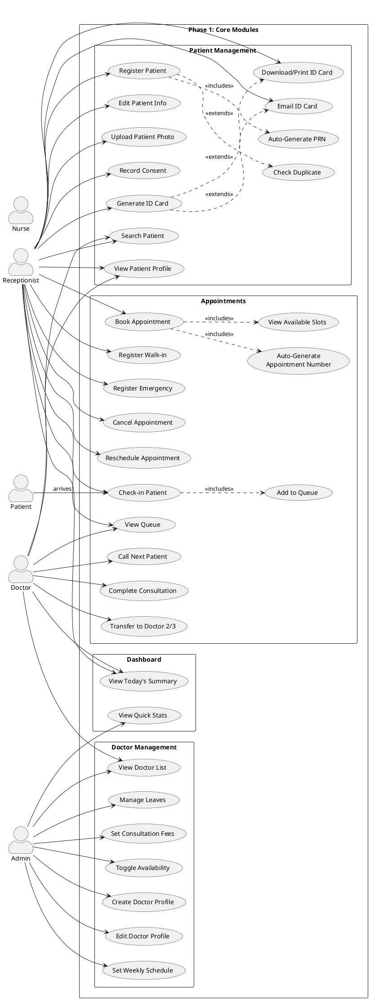

# Phase 1 — Core: Use Cases

> Patient Registration, Doctors, Appointments, ID Cards, Dashboard

---

## Actors

| Actor | Description |
|-------|-------------|
| **Receptionist** | Registers patients, books appointments, manages check-in |
| **Doctor** | Conducts consultations, manages own schedule, calls patients |
| **Admin** | Manages doctor profiles, departments, schedules, fees |
| **Nurse** | Records vitals, assists clinical workflow |
| **Patient** | External actor — receives ID card, arrives for appointment |
| **System** | Auto-generates PRN, appointment numbers, queue positions |

---

## Use Case Diagram



---

## Use Case Descriptions

### Patient Management

#### UC01: Register New Patient

| Field | Value |
|-------|-------|
| **Actor** | Receptionist |
| **Precondition** | Receptionist is logged in |
| **Main Flow** | 1. Receptionist clicks "Register Patient" → 2. Fills form: name, DOB/age, gender, phone (with country code), address, emergency contact → 3. Optionally uploads photo → 4. System checks for duplicates (phone number) → 5. System auto-generates 12-digit PRN → 6. Patient saved → 7. Optionally generates ID card |
| **Post-condition** | Patient record created with unique PRN |

#### UC02: Search Patient

| Field | Value |
|-------|-------|
| **Actor** | Receptionist, Doctor |
| **Main Flow** | 1. User enters search term (name, phone, PRN, email) → 2. System returns matching patients with pagination → 3. User clicks to view patient profile |

#### UC06: Check Duplicate Patient

| Field | Value |
|-------|-------|
| **Actor** | System (during registration) |
| **Main Flow** | 1. System checks if phone number already exists → 2. If duplicate found, warns user with existing patient details → 3. User can proceed or cancel |

#### UC08: Generate Patient ID Card

| Field | Value |
|-------|-------|
| **Actor** | Receptionist |
| **Precondition** | Patient is registered |
| **Main Flow** | 1. Receptionist opens patient profile → 2. Clicks "Generate ID Card" → 3. System creates card: **Front** (hospital logo, patient photo, name, DOB, gender, blood group, PRN, QR code) + **Back** (hospital details, emergency number) → 4. Can download PDF, print, or email to patient |

### Doctor Management

#### UC11: Create Doctor Profile

| Field | Value |
|-------|-------|
| **Actor** | Admin |
| **Precondition** | User account exists with "doctor" role |
| **Main Flow** | 1. Admin selects user → 2. Fills doctor details: department, specialization, qualification, registration number, experience, consultation fee, follow-up fee → 3. System creates doctor profile linked to user → 4. Sets default availability to active |

#### UC14: Set Weekly Schedule

| Field | Value |
|-------|-------|
| **Actor** | Admin, Doctor |
| **Main Flow** | 1. Opens doctor schedule page → 2. For each day (Mon–Sat): sets start time, end time, break start, break end, slot duration (e.g., 15 min), max patients → 3. System saves schedule → 4. Available slots auto-calculated from schedule |

#### UC15: Manage Doctor Leaves

| Field | Value |
|-------|-------|
| **Actor** | Admin |
| **Main Flow** | 1. Admin opens doctor's leave page → 2. Creates leave: date, type (full/morning/afternoon), reason → 3. System marks doctor unavailable for that date → 4. Existing appointments for that date should be flagged for rescheduling |

### Appointments

#### UC18: Book Scheduled Appointment

| Field | Value |
|-------|-------|
| **Actor** | Receptionist |
| **Main Flow** | 1. Receptionist searches and selects patient → 2. Selects department & doctor → 3. Picks date → 4. System shows available time slots (from doctor's schedule, minus booked + breaks + leaves) → 5. Receptionist selects slot → 6. Fills: appointment type, visit type, priority, chief complaint → 7. System auto-generates appointment number (APT-XXXXXX) → 8. Appointment saved with status "Scheduled" |

#### UC19: Register Walk-in

| Field | Value |
|-------|-------|
| **Actor** | Receptionist |
| **Main Flow** | Same as UC18 but appointment type = "walk_in", may skip slot selection (use next available) |

#### UC22: Check-in Patient

| Field | Value |
|-------|-------|
| **Actor** | Receptionist |
| **Precondition** | Appointment exists with status "Scheduled", patient has arrived |
| **Main Flow** | 1. Receptionist finds appointment → 2. Clicks "Check In" → 3. System updates status: Scheduled → Checked In → In Queue → 4. System auto-adds patient to doctor's queue with queue number and position → 5. Estimated wait time calculated (position × slot duration) |

#### UC24: Call Next Patient

| Field | Value |
|-------|-------|
| **Actor** | Doctor |
| **Main Flow** | 1. Doctor views their queue → 2. Clicks "Call Next" → 3. System picks first waiting patient → 4. Updates queue status to "In Consultation" → 5. Updates appointment status to "With Doctor" → 6. Records consultation start timestamp |

#### UC25: Complete Consultation

| Field | Value |
|-------|-------|
| **Actor** | Doctor |
| **Main Flow** | 1. Doctor finishes consultation → 2. Updates status to "Completed" → 3. System records consultation end timestamp → 4. Patient removed from queue |
| **Alternate** | Doctor may write a prescription (Phase 2) before completing |

#### UC26: Cancel Appointment

| Field | Value |
|-------|-------|
| **Actor** | Receptionist |
| **Precondition** | Appointment is not yet completed |
| **Main Flow** | 1. Receptionist finds appointment → 2. Clicks "Cancel" → 3. Enters cancel reason → 4. System updates status to "Cancelled" → 5. Removes from queue if checked in |

#### UC27: Reschedule Appointment

| Field | Value |
|-------|-------|
| **Actor** | Receptionist |
| **Main Flow** | 1. Receptionist finds appointment → 2. Clicks "Reschedule" → 3. Selects new date + slot → 4. System marks old appointment as "Rescheduled" → 5. Creates new appointment linked to original (parent_appointment_id) → 6. Increments reschedule count |

#### UC28: Transfer to Another Doctor

| Field | Value |
|-------|-------|
| **Actor** | Doctor |
| **Main Flow** | 1. Doctor 1 completes initial assessment → 2. Decides patient needs specialist → 3. Clicks "Transfer" → 4. Selects Doctor 2 → 5. System creates new queue entry for Doctor 2 → 6. Doctor 2 calls patient from their queue → 7. Can chain: Doctor 2 → Doctor 3 |

### Dashboard

#### UC29: View Today's Summary

| Field | Value |
|-------|-------|
| **Actor** | Receptionist, Doctor, Admin |
| **Main Flow** | 1. User opens Dashboard → 2. System shows today's stats: total appointments, scheduled, checked-in, in-queue, with-doctor, completed, cancelled → 3. Shows walk-in and emergency counts → 4. Quick action buttons: Register Patient, Book Appointment, View Doctors |

---

## Flow: Patient Registration → ID Card

```
Receptionist                System                      Database
  │                            │                            │
  │── Fill patient form ──────▶│                            │
  │   (name, phone, DOB,       │                            │
  │    gender, address)        │                            │
  │                            │── Check duplicate ────────▶│
  │                            │◀── No duplicate ──────────│
  │                            │                            │
  │                            │── Generate PRN ────────────│
  │                            │   (HMS-000001)             │
  │                            │── Save patient ───────────▶│
  │◀── Patient created ───────│                            │
  │                            │                            │
  │── Click "Generate         │                            │
  │    ID Card" ──────────────▶│                            │
  │                            │── Create card front ───────│
  │                            │   (photo, name, PRN, QR)   │
  │                            │── Create card back ────────│
  │                            │   (hospital details)       │
  │◀── ID Card PDF ───────────│                            │
  │                            │                            │
  │── Download / Print / Email │                            │
```

---

## Flow: Appointment Booking → Consultation

```
Receptionist      System           Doctor            Queue
  │                  │                │                │
  │── Search patient▶│                │                │
  │── Select doctor ▶│                │                │
  │── Pick date ────▶│                │                │
  │                  │── Get slots ───│                │
  │◀── Show slots ──│                │                │
  │── Select slot ──▶│                │                │
  │── Book ─────────▶│                │                │
  │                  │── Generate APT#│                │
  │◀── Booked ──────│                │                │
  │                  │                │                │
  │  ... Patient arrives ...          │                │
  │                  │                │                │
  │── Check In ─────▶│                │                │
  │                  │── Status: Checked In ──────────▶│
  │                  │── Add to Queue ────────────────▶│
  │                  │── Calculate wait time ─────────│
  │◀── In Queue ────│                │                │
  │                  │                │                │
  │                  │                │── Call Next ──▶│
  │                  │                │◀── Patient ───│
  │                  │── Status: With Doctor ─────────│
  │                  │                │                │
  │                  │                │── Complete ───▶│
  │                  │── Status: Completed ───────────│
```

---

## Flow: Doctor Transfer (Doctor 1 → 2 → 3)

```
Doctor 1             System              Doctor 2            Doctor 3
  │                    │                    │                    │
  │── Consult patient ▶│                    │                    │
  │── Transfer to Dr2 ▶│                    │                    │
  │                    │── Create queue     │                    │
  │                    │   entry for Dr2 ──▶│                    │
  │                    │                    │                    │
  │                    │                    │── Call Next ──────▶│
  │                    │                    │   (sees patient)   │
  │                    │                    │── Consult ─────────│
  │                    │                    │── Transfer to Dr3 ▶│
  │                    │                    │                    │
  │                    │── Create queue     │                    │
  │                    │   entry for Dr3 ──────────────────────▶│
  │                    │                    │                    │
  │                    │                    │                    │── Call Next
  │                    │                    │                    │── Consult
  │                    │                    │                    │── Complete
  │                    │── Final status: Completed ─────────────│
```
