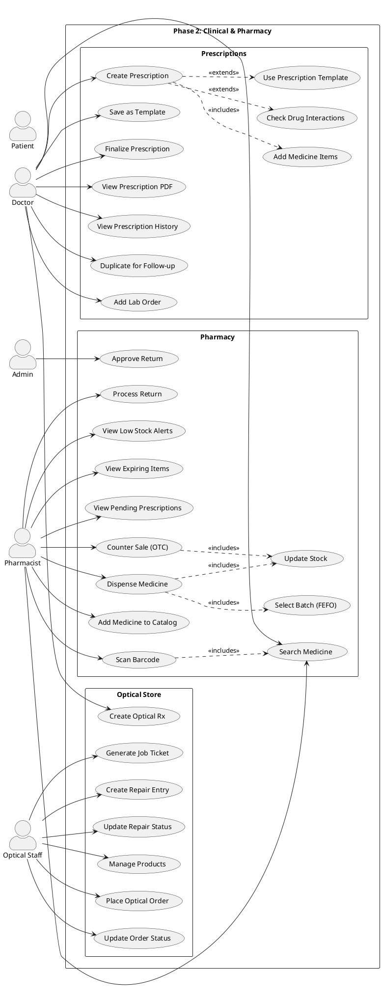

# Phase 2 — Clinical: Use Cases

> Prescriptions, Pharmacy Dispensing, Optical Store

---

## Actors

| Actor | Description |
|-------|-------------|
| **Doctor** | Creates prescriptions, optical Rx, checks drug interactions |
| **Pharmacist** | Dispenses medicines, manages catalog, handles returns |
| **Optical Staff** | Manages optical products, orders, repairs |
| **Admin** | Approves pharmacy returns |
| **Patient** | Receives medicines, optical products |
| **System** | Drug interaction checks, FEFO batch selection, stock updates |

---

## Use Case Diagram



---

## Use Case Descriptions

### Prescriptions

#### UC01: Create Prescription

| Field | Value |
|-------|-------|
| **Actor** | Doctor |
| **Precondition** | Patient has an active appointment (status: With Doctor) |
| **Main Flow** | 1. Doctor opens prescription form from appointment → 2. Enters diagnosis and clinical notes → 3. Adds medicine items (name, dosage, frequency, duration, route, instructions) → 4. System checks for drug interactions between items → 5. If interaction found, shows warning (Doctor can proceed or change) → 6. Adds advice for patient → 7. Saves prescription as draft |
| **Post-condition** | Prescription created, linked to appointment and patient |

#### UC03: Check Drug Interactions

| Field | Value |
|-------|-------|
| **Actor** | System (triggered automatically) |
| **Main Flow** | 1. When doctor adds 2+ medicines → 2. System checks interaction database → 3. If interaction found, shows alert with severity (low/medium/high) and recommendation → 4. Doctor acknowledges and decides to proceed or substitute |

#### UC04: Use Prescription Template

| Field | Value |
|-------|-------|
| **Actor** | Doctor |
| **Main Flow** | 1. Doctor clicks "Use Template" → 2. Selects from saved templates (e.g., "Common Cold", "UTI") → 3. System pre-fills medicine items, dosage, and advice → 4. Doctor can modify before saving |

#### UC06: Finalize Prescription

| Field | Value |
|-------|-------|
| **Actor** | Doctor |
| **Main Flow** | 1. Doctor reviews prescription → 2. Clicks "Finalize" → 3. Prescription is locked (no further edits) → 4. Becomes visible to Pharmacy for dispensing → 5. Version is saved for history |

### Pharmacy

#### UC11: View Pending Prescriptions

| Field | Value |
|-------|-------|
| **Actor** | Pharmacist |
| **Main Flow** | 1. Pharmacist opens Pharmacy Dashboard → 2. Sees list of finalized prescriptions awaiting dispensing → 3. Each entry shows patient name, doctor, number of items → 4. Clicks to start dispensing |

#### UC12: Dispense Medicine (against Rx)

| Field | Value |
|-------|-------|
| **Actor** | Pharmacist |
| **Precondition** | Prescription is finalized |
| **Main Flow** | 1. Pharmacist opens prescription → 2. For each medicine item: selects batch (FEFO — First Expiry First Out) → 3. System validates: batch not expired, sufficient stock → 4. Enters quantity dispensed → 5. Can substitute if allowed (records original) → 6. Confirms dispensing → 7. System auto-reduces batch stock → 8. Creates dispensing record with billing info → 9. Status updated to "Dispensed" |
| **Exception** | If stock insufficient → shows alert, pharmacist can partially dispense |

#### UC14: Counter Sale (OTC)

| Field | Value |
|-------|-------|
| **Actor** | Pharmacist |
| **Precondition** | No prescription needed (over-the-counter sale) |
| **Main Flow** | 1. Pharmacist clicks "Counter Sale" → 2. Optionally links to patient or enters customer name/phone → 3. Searches and adds medicines → 4. Selects batch, enters quantity → 5. System calculates total → 6. Confirms sale → 7. Stock reduced, record created |

#### UC18: Process Pharmacy Return

| Field | Value |
|-------|-------|
| **Actor** | Pharmacist |
| **Main Flow** | 1. Pharmacist clicks "Return" → 2. Finds original dispensing record → 3. Selects items to return + quantity → 4. Enters return reason → 5. Submits for approval → 6. Admin approves → 7. Stock restored, credit note generated |

### Optical Store

#### UC22: Create Optical Rx

| Field | Value |
|-------|-------|
| **Actor** | Doctor (Ophthalmologist) |
| **Main Flow** | 1. Doctor opens optical Rx form → 2. Selects patient → 3. Enters measurements: Right eye (SPH, CYL, AXIS, ADD) + Left eye → 4. Enters PD (pupillary distance) → 5. Adds notes/recommendations → 6. Saves Rx |
| **Validation** | SPH: -25 to +25 (step 0.25), CYL: -10 to +10, AXIS: 0-180, ADD: 0-4, PD: 50-80mm |

#### UC24: Place Optical Order

| Field | Value |
|-------|-------|
| **Actor** | Optical Staff |
| **Main Flow** | 1. Optical Staff opens patient's optical Rx → 2. Selects frame + lens products from catalog → 3. Enters customization details (lens type, coating, tint) → 4. System calculates total → 5. Creates order with status "Ordered" → 6. Can generate job ticket PDF for lab |

#### UC27: Create Repair Entry

| Field | Value |
|-------|-------|
| **Actor** | Optical Staff |
| **Main Flow** | 1. Customer brings item for repair → 2. Staff creates repair entry: item description, issue, estimated cost → 3. Status set to "Received" → 4. Updates status as repair progresses (In Progress → Ready → Delivered) |

---

## Flow: Prescription → Pharmacy Dispensing

```
Doctor                System              Pharmacist           Stock
  │                      │                    │                  │
  │── Create Rx ────────▶│                    │                  │
  │── Add medicines ────▶│                    │                  │
  │                      │── Check drug       │                  │
  │                      │   interactions ────│                  │
  │◀── Warning (if any) ─│                    │                  │
  │── Finalize Rx ──────▶│                    │                  │
  │                      │── Notify pharmacy ▶│                  │
  │                      │                    │                  │
  │                      │                    │── View pending ──│
  │                      │                    │── Open Rx ───────│
  │                      │                    │                  │
  │                      │                    │── Select batch ─▶│
  │                      │                    │   (FEFO order)   │
  │                      │                    │◀── Batch info ──│
  │                      │                    │                  │
  │                      │                    │── Dispense ─────▶│
  │                      │                    │                  │── Reduce stock
  │                      │                    │                  │
  │                      │── Create billing ──│                  │
  │                      │   record           │                  │
```

---

## Flow: Optical Rx → Order → Job Ticket

```
Doctor              System              Optical Staff
  │                    │                    │
  │── Create          │                    │
  │   Optical Rx ────▶│                    │
  │   (SPH, CYL,      │                    │
  │    AXIS, PD)       │                    │
  │                    │                    │
  │                    │                    │── View Rx ────────▶
  │                    │                    │── Select frame ───▶
  │                    │                    │── Select lens ────▶
  │                    │                    │── Place order ────▶
  │                    │── Generate         │
  │                    │   job ticket PDF ──│
  │                    │                    │
  │                    │                    │── Update status:
  │                    │                    │   Ordered → In Lab
  │                    │                    │   → Ready → Delivered
```

---

## Flow: Counter Sale (OTC without Rx)

```
Walk-in Customer      Pharmacist            System             Stock
  │                      │                    │                  │
  │── Requests medicine ▶│                    │                  │
  │                      │── Search medicine ▶│                  │
  │                      │   (or scan barcode)│                  │
  │                      │◀── Results ────────│                  │
  │                      │                    │                  │
  │                      │── Select batch ───▶│                  │
  │                      │── Enter quantity ──▶│                  │
  │                      │                    │── Validate stock ▶│
  │                      │                    │◀── OK ───────────│
  │                      │                    │                  │
  │                      │── Confirm sale ───▶│                  │
  │                      │                    │── Reduce stock ──▶│
  │                      │                    │── Create record ──│
  │◀── Receipt ──────────│                    │                  │
```
