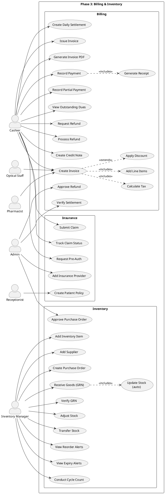

# Phase 3 — Billing & Inventory: Use Cases

> Invoicing, Payments, Refunds, Insurance, Inventory Management

---

## Actors

| Actor | Description |
|-------|-------------|
| **Cashier** | Creates invoices, records payments, processes refunds |
| **Receptionist** | Creates patient insurance policies |
| **Admin** | Approves refunds, verifies settlements, approves POs |
| **Pharmacist** | Creates pharmacy invoices (auto from dispensing) |
| **Optical Staff** | Creates optical invoices |
| **Inventory Manager** | Purchase orders, goods receipt, stock management |
| **System** | Tax calculation, stock alerts, auto-status transitions |
| **Patient** | Receives invoices, makes payments |

---

## Use Case Diagram



---

## Use Case Descriptions

### Billing

#### UC01: Create Invoice

| Field | Value |
|-------|-------|
| **Actor** | Cashier (or Pharmacist/Optical Staff for their modules) |
| **Precondition** | Patient has received services (consultation, pharmacy, optical) |
| **Main Flow** | 1. Cashier selects patient and appointment → 2. Adds line items: consultation fee, procedure charges, pharmacy charges, optical charges → 3. System calculates subtotal → 4. Apply discount (if any) with reason → 5. System auto-calculates tax per item based on tax configuration → 6. Invoice total = subtotal - discount + tax → 7. Save as draft |

#### UC05: Issue Invoice

| Field | Value |
|-------|-------|
| **Actor** | Cashier |
| **Main Flow** | 1. Cashier reviews draft invoice → 2. Clicks "Issue" → 3. Invoice is finalized (locked) → 4. System assigns invoice number → 5. Status: Draft → Issued → 6. Invoice PDF can be generated |

#### UC07: Record Payment

| Field | Value |
|-------|-------|
| **Actor** | Cashier |
| **Main Flow** | 1. Cashier opens issued invoice → 2. Selects payment mode (cash/card/UPI/bank transfer/insurance) → 3. Enters amount and reference number → 4. System records payment → 5. Auto-updates invoice status: Issued → Partially Paid → Paid → 6. Generates payment receipt |
| **Alternate** | Multiple payments accepted (partial payments until fully paid) |

#### UC11: Request Refund

| Field | Value |
|-------|-------|
| **Actor** | Cashier |
| **Main Flow** | 1. Cashier opens paid invoice → 2. Clicks "Request Refund" → 3. Enters refund amount (≤ paid amount) and reason → 4. Submits for admin approval |

#### UC12: Approve Refund

| Field | Value |
|-------|-------|
| **Actor** | Admin |
| **Main Flow** | 1. Admin views pending refund requests → 2. Reviews reason and amount → 3. Approves or rejects → 4. If approved, Cashier can process the refund |

#### UC15: Create Daily Settlement

| Field | Value |
|-------|-------|
| **Actor** | Cashier |
| **Main Flow** | 1. At end of day, Cashier creates settlement → 2. System sums all payments collected by this cashier for today → 3. Cashier counts cash and enters actual collection → 4. System shows variance (if any) → 5. Settlement submitted for admin verification |

### Insurance

#### UC18: Create Patient Insurance Policy

| Field | Value |
|-------|-------|
| **Actor** | Receptionist |
| **Main Flow** | 1. During patient registration or later → 2. Receptionist selects insurance provider → 3. Enters policy number, group number, validity dates, coverage details → 4. Links policy to patient record |

#### UC19: Submit Insurance Claim

| Field | Value |
|-------|-------|
| **Actor** | Cashier |
| **Main Flow** | 1. After invoice is issued for insured patient → 2. Cashier creates claim against patient's policy → 3. Enters claim amount, supporting documents → 4. Submits to insurance provider → 5. Tracks status: Submitted → Under Review → Approved/Rejected → Settled |

#### UC21: Request Pre-Authorization

| Field | Value |
|-------|-------|
| **Actor** | Cashier |
| **Main Flow** | 1. Before expensive procedure → 2. Cashier creates pre-auth request with estimated cost → 3. Submits to insurance → 4. Tracks approval status → 5. If approved, procedure can proceed with insurance coverage |

### Inventory

#### UC24: Create Purchase Order

| Field | Value |
|-------|-------|
| **Actor** | Inventory Manager |
| **Main Flow** | 1. Inventory Manager reviews reorder alerts → 2. Creates PO: selects supplier → 3. Adds items with quantities and expected prices → 4. PO total calculated → 5. Submits for admin approval |

#### UC25: Approve Purchase Order

| Field | Value |
|-------|-------|
| **Actor** | Admin |
| **Main Flow** | 1. Admin reviews PO details: supplier, items, amounts → 2. Approves or rejects → 3. If approved, PO sent to supplier |

#### UC26: Receive Goods (GRN)

| Field | Value |
|-------|-------|
| **Actor** | Inventory Manager |
| **Precondition** | PO has been approved and goods have arrived |
| **Main Flow** | 1. Inventory Manager creates GRN against PO → 2. For each item: enters received quantity, batch number, manufacturing date, expiry date, actual price → 3. System compares received vs ordered quantities → 4. Submits GRN → 5. After verification, stock is updated |

#### UC28: Adjust Stock

| Field | Value |
|-------|-------|
| **Actor** | Inventory Manager |
| **Main Flow** | 1. Inventory discrepancy found (damage, loss, found items) → 2. Creates stock adjustment: item, quantity (+/-), reason → 3. Submits for approval → 4. Admin approves → 5. Stock updated |

#### UC32: Conduct Cycle Count

| Field | Value |
|-------|-------|
| **Actor** | Inventory Manager |
| **Main Flow** | 1. Initiates cycle count for selected items/location → 2. Physically counts items → 3. Enters counted quantities → 4. System compares with system quantities → 5. Shows variance report → 6. Admin verifies → 7. Stock adjusted to match physical count |

---

## Flow: Consultation → Invoice → Payment

```
Doctor          System          Cashier          Patient
  │                │                │                │
  │── Complete     │                │                │
  │   consultation▶│                │                │
  │── Write Rx ───▶│                │                │
  │                │                │                │
  │                │   (Pharmacy dispenses)          │
  │                │                │                │
  │                │                │── Create       │
  │                │                │   Invoice ────▶│
  │                │                │   - Consultation│
  │                │                │   - Medicines   │
  │                │◀── Calc tax ──│                │
  │                │──▶ Total ────▶│                │
  │                │                │                │
  │                │                │── Issue ──────▶│
  │                │                │── Invoice PDF ▶│
  │                │                │                │
  │                │                │◀── Payment ───│
  │                │                │   (cash/card)  │
  │                │                │── Receipt ────▶│
```

---

## Flow: Purchase Order → GRN → Stock Update

```
Inventory Mgr        Admin            System            Stock
  │                    │                 │                 │
  │── View reorder    │                 │                 │
  │   alerts ────────▶│                 │◀── Low stock ──│
  │                    │                 │                 │
  │── Create PO ─────▶│                 │                 │
  │   (supplier,       │                 │                 │
  │    items, qty)     │                 │                 │
  │                    │── Approve PO ──▶│                 │
  │                    │                 │                 │
  │  ... Goods arrive ...                │                 │
  │                    │                 │                 │
  │── Create GRN ────▶│                 │                 │
  │   (received qty,   │                 │                 │
  │    batch, expiry)  │                 │                 │
  │                    │                 │                 │
  │── Verify GRN ────▶│                 │                 │
  │                    │                 │── Update ──────▶│
  │                    │                 │   stock         │
  │                    │                 │                 │
```

---

## Flow: Insurance Claim

```
Receptionist        Cashier            System          Insurance
  │                    │                 │                 │
  │── Add patient     │                 │                 │
  │   policy ────────▶│                 │                 │
  │                    │                 │                 │
  │                    │── Pre-auth     │                 │
  │                    │   request ────▶│                 │
  │                    │                 │── Submit ──────▶│
  │                    │                 │◀── Approved ───│
  │                    │                 │                 │
  │                    │  (after service)│                 │
  │                    │                 │                 │
  │                    │── Submit       │                 │
  │                    │   claim ──────▶│                 │
  │                    │                 │── Submit ──────▶│
  │                    │                 │◀── Status ─────│
  │                    │                 │   (Under Review)│
  │                    │                 │◀── Settled ────│
  │                    │◀── Payment ───│                 │
```
