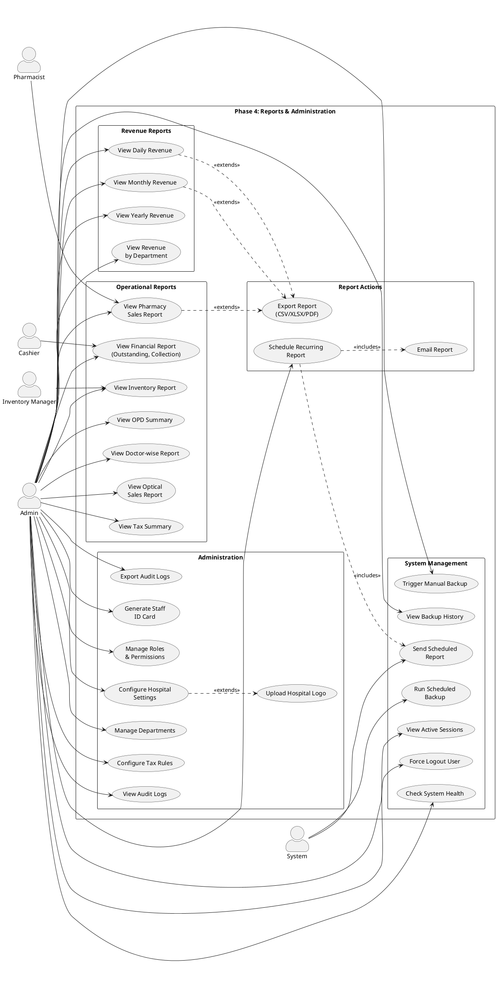

# Phase 4 — Reports & Admin: Use Cases

> Revenue Reports, Departmental Analytics, Admin Panel, Audit, Backups

---

## Actors

| Actor | Description |
|-------|-------------|
| **Admin** | Full access to reports, settings, audit, backups |
| **Cashier** | Views financial reports, collection reports |
| **Pharmacist** | Views pharmacy reports |
| **Inventory Manager** | Views inventory reports |
| **System** | Generates scheduled reports, runs backups |

---

## Use Case Diagram



---

## Use Case Descriptions

### Revenue Reports

#### UC01: View Daily Revenue Report

| Field | Value |
|-------|-------|
| **Actor** | Admin |
| **Main Flow** | 1. Admin opens Reports → Revenue → Daily → 2. Selects date range → 3. System shows: total revenue, OPD revenue, pharmacy revenue, optical revenue → 4. Displays bar/line chart with daily breakdown → 5. Shows total invoices, total patients, average ticket size → 6. Can filter by department → 7. Can export to CSV/XLSX/PDF |

#### UC04: View Revenue by Department

| Field | Value |
|-------|-------|
| **Actor** | Admin |
| **Main Flow** | 1. Admin selects date range → 2. System shows revenue breakdown per department (OPD, Pharmacy, Optical, etc.) → 3. Displays pie chart + table → 4. Shows MoM (month-over-month) and YoY (year-over-year) trends |

### Operational Reports

#### UC05: View OPD Summary Report

| Field | Value |
|-------|-------|
| **Actor** | Admin |
| **Main Flow** | 1. Selects date range → 2. System shows: total appointments, new vs follow-up, walk-in count, emergency count → 3. Shows department-wise breakdown → 4. Average wait time, consultation time → 5. Cancellation and no-show rates |

#### UC06: View Doctor-wise Report

| Field | Value |
|-------|-------|
| **Actor** | Admin |
| **Main Flow** | 1. Selects date range and optionally a doctor → 2. System shows per-doctor: total consultations, revenue generated, average consultation time, patient satisfaction → 3. Comparative chart across doctors |

#### UC07: View Pharmacy Sales Report

| Field | Value |
|-------|-------|
| **Actor** | Admin, Pharmacist |
| **Main Flow** | 1. Selects date range → 2. System shows: total pharmacy sales, prescription vs counter sale split, top-selling medicines → 3. Returns and refunds summary → 4. Batch expiry overview |

#### UC09: View Inventory Report

| Field | Value |
|-------|-------|
| **Actor** | Admin, Inventory Manager |
| **Main Flow** | 1. Selects report type: Stock Status / Aging / Movement → 2. Stock Status: shows current quantities, reorder items → 3. Aging: shows items by age bracket → 4. Movement: shows inflow/outflow for period |

#### UC10: View Financial Report

| Field | Value |
|-------|-------|
| **Actor** | Admin, Cashier |
| **Main Flow** | 1. Selects date range → 2. System shows: total outstanding dues, collection by payment mode (cash/card/UPI), settlement summary → 3. Outstanding aging (0-30, 31-60, 61-90, 90+ days) |

### Report Actions

#### UC12: Export Report

| Field | Value |
|-------|-------|
| **Actor** | Admin (others for their module reports) |
| **Main Flow** | 1. User views any report → 2. Clicks "Export" → 3. Selects format: CSV, XLSX, or PDF → 4. System generates file → 5. Download starts automatically |

#### UC13: Schedule Recurring Report

| Field | Value |
|-------|-------|
| **Actor** | Admin |
| **Main Flow** | 1. Admin selects report type → 2. Sets frequency (daily/weekly/monthly) → 3. Selects recipients (email addresses) → 4. Configures format (PDF/XLSX) → 5. System auto-generates and emails at scheduled time |

### Administration

#### UC15: Configure Hospital Settings

| Field | Value |
|-------|-------|
| **Actor** | Admin |
| **Main Flow** | 1. Admin opens Settings page → 2. Configures: hospital name, address, phone, email, website → 3. Uploads hospital logo → 4. Sets currency, timezone, date format → 5. Configures PRN prefix and starting number → 6. Saves settings |

#### UC17: Manage Departments

| Field | Value |
|-------|-------|
| **Actor** | Admin |
| **Main Flow** | 1. Admin views department list → 2. Can create department: name, code, description, display order → 3. Edit existing departments → 4. Deactivate departments (soft delete) → 5. Department codes used in PRN generation |

#### UC18: Configure Tax Rules

| Field | Value |
|-------|-------|
| **Actor** | Admin |
| **Main Flow** | 1. Admin opens Tax Config → 2. Creates tax rule: name (e.g., GST 18%), rate, applicable items/categories → 3. Sets effective date → 4. Tax auto-applied to invoice line items matching the category |

#### UC19: View Audit Logs

| Field | Value |
|-------|-------|
| **Actor** | Admin |
| **Main Flow** | 1. Admin opens Audit Log page → 2. Filters: user, action (create/update/delete/login), entity type, date range → 3. Sees chronological list with: who, what, when, what changed → 4. Can export filtered results |

#### UC21: Generate Staff ID Card

| Field | Value |
|-------|-------|
| **Actor** | Admin |
| **Main Flow** | 1. Admin opens user profile → 2. Ensures photo is uploaded → 3. Clicks "Generate ID Card" → 4. System creates card: **Front** (hospital logo, staff photo, name, role, department, reference number, QR code) + **Back** (hospital details) → 5. Can download, print, or email |

### System Management

#### UC23: Trigger Manual Backup

| Field | Value |
|-------|-------|
| **Actor** | Admin |
| **Main Flow** | 1. Admin opens Backup page → 2. Clicks "Create Backup" → 3. System backs up database + uploaded files → 4. Backup stored with timestamp → 5. Shows in backup history |

#### UC25: View Active Sessions

| Field | Value |
|-------|-------|
| **Actor** | Admin |
| **Main Flow** | 1. Admin opens Active Sessions → 2. Sees list of logged-in users: name, role, login time, IP address, device → 3. Can force logout any user (revokes their tokens) |

#### UC27: Check System Health

| Field | Value |
|-------|-------|
| **Actor** | Admin |
| **Main Flow** | 1. Admin opens System Health → 2. Sees status of: database connection, Redis, file storage, email service → 3. Shows uptime, memory usage, active connections → 4. Alerts if any service is down |

---

## Flow: Monthly Report Generation (Scheduled)

```
System (Scheduler)       Report Service       Email Service       Admin
  │                          │                      │               │
  │── Trigger monthly       │                      │               │
  │   report ──────────────▶│                      │               │
  │                          │── Query DB ──────────│               │
  │                          │── Aggregate data ────│               │
  │                          │── Generate PDF ──────│               │
  │                          │                      │               │
  │                          │── Send email ────────▶               │
  │                          │   (with PDF)         │── Deliver ──▶│
  │                          │                      │               │
  │── Log completion ───────│                      │               │
```

---

## Flow: Audit Log Review

```
Admin                   System                  Database
  │                        │                       │
  │── Open Audit Logs ────▶│                       │
  │── Set filters:         │                       │
  │   User: "doctor1"      │                       │
  │   Action: "update"     │                       │
  │   Date: last 7 days   │                       │
  │                        │── Query audit_logs ──▶│
  │                        │◀── Results ──────────│
  │◀── Show log entries:  │                       │
  │   - Who did it         │                       │
  │   - What entity        │                       │
  │   - What changed       │                       │
  │   - When               │                       │
  │                        │                       │
  │── Export to CSV ──────▶│                       │
  │◀── Download ──────────│                       │
```

---

## Flow: End-to-End System Integration (Cross-Phase)

This shows how all phases connect together:

```
Phase 0            Phase 1              Phase 2            Phase 3           Phase 4
─────────         ──────────           ──────────         ──────────        ──────────

Login ───▶ Dashboard
              │
              ├──▶ Register Patient
              │         │
              │         └──▶ Generate ID Card
              │
              ├──▶ Book Appointment
              │         │
              │         └──▶ Check-in ──▶ Queue
              │                            │
              │                            └──▶ Consultation
              │                                     │
              │                                     ├──▶ Prescription ──▶ Pharmacy ──▶ Invoice ──▶ Revenue
              │                                     │                     Dispense      Payment    Report
              │                                     │
              │                                     ├──▶ Optical Rx ───▶ Optical ────▶ Invoice ──▶ Revenue
              │                                     │                     Order         Payment    Report
              │                                     │
              │                                     └──▶ Transfer ──▶ Doctor 2 ──▶ ...
              │
              └──▶ Manage Doctors
                    Manage Departments ──────────────────────────────────────────────▶ Admin
                                                                                      Settings
                                                                                      Audit Logs
                                                                                      Backups
```
